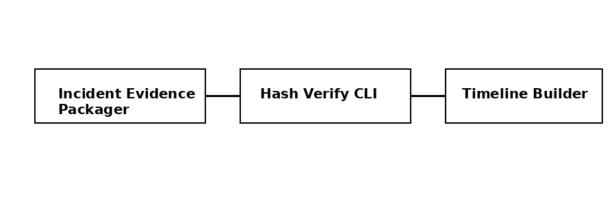

# hash-verify-cli

A minimal CLI to independently verify SHA256 hashes.

## DFIR Toolchain

This tool represents the **verification** phase of the DFIR workflow.

## Features
- Hash verification
- Detects missing or modified files
- Clear exit codes

## License
MIT
